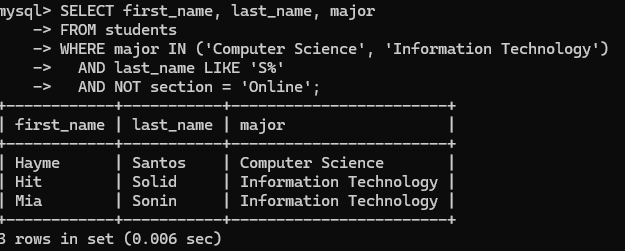
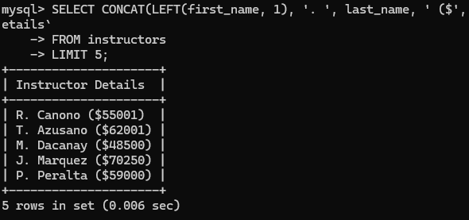
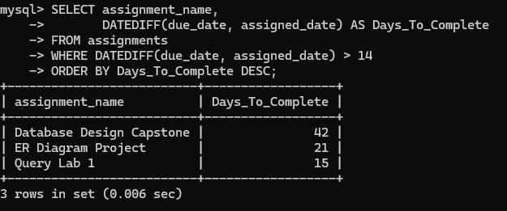
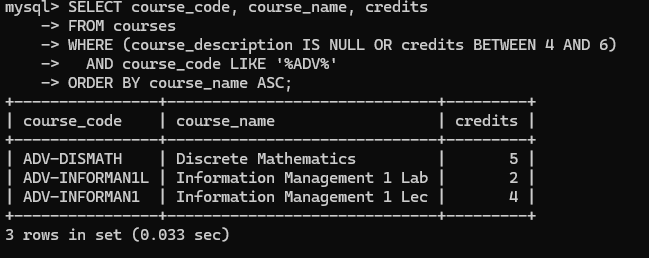

# Week 7 Lab: SQL 3 (Functions, Aliases & Filtering)

## Task 1: Complex Student Roster

```sql
SELECT first_name, last_name, major
FROM students
WHERE major IN ('Computer Science', 'Information Technology')
  AND last_name LIKE 'S%'
  AND NOT section = 'Online';
```



## Task 2: Formatting Employee Data

```sql
SELECT CONCAT(LEFT(first_name, 1), '. ', last_name, ' ($', ROUND(salary), ')') AS `Instructor Details`
FROM instructors
LIMIT 5;
```



## Task 3: Project Deadline Analysis

```sql
SELECT assignment_name,
       DATEDIFF(due_date, assigned_date) AS Days_To_Complete
FROM assignments
WHERE DATEDIFF(due_date, assigned_date) > 14
ORDER BY Days_To_Complete DESC;
```



## Task 4: Comprehensive Data Audit

```sql
SELECT course_code, course_name, credits
FROM courses
WHERE (course_description IS NULL OR credits BETWEEN 4 AND 6)
  AND course_code LIKE '%ADV%'
ORDER BY course_name ASC;
```



**Explanation of AND/OR precedence:**
In MySQL, `AND` has higher precedence than `OR`, so without parentheses `credits BETWEEN 4 AND 6 AND course_code LIKE '%ADV%'` would be evaluated first and then combined with `course_description IS NULL` using OR. That would return every course with a missing description, even without "ADV" in its code. I put parentheses around the two OR conditions so they are evaluated first. A course now needs a missing description or 4 to 6 credits, and its code must also contain "ADV".